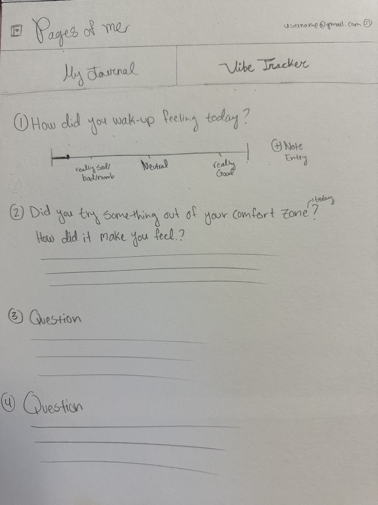

# Pages of Me

[View Notes](notes.md)

## Specification Deliverable

### Elevator pitch

In high school, most of us go through a phase of keeping a journal, where we write about our day-to-day activities and emotions, only to forget about it the next day.

Have you ever wanted to go back to these journals? Perhaps you are reminiscing these days and want to relive the joyful moments you had with your loved ones. In another case, you might want to reflect on your personal growth and how far you have come to leave the past in the past. 

With Pages of Me, you can easily maintain a journal that you can edit in your style. Additionally, there will be a section for a short survey where you can log in your moods and feelings and their triggers which allows you to notice beneficial and harmful habits that you might want to either progress or prevent doing based on your personal goals.

### Design
<!--  -->
 
 

### Key Features

* Secure login over HTTPS
* Two tab choices to swtich between the journal and survey
* Display of note sheet
* Menu to adjust the theme of the journal
* Ability to choose different colors, fonts, stickers from the menu
* Ability to scroll across the slider for mood entry
* Button next to survey questions to add notes
* Ability to create an account to save information

### Technologies

* **HTML** -- Uses correct HTML structure for application. Three HTML pages:
1. One for creating an account
2. One for the journal
3. One for the survery

    HTML will also be used for the structure of the tabs, text area for note taking and journal, drop down buttons for menu options, and slider for mood entry.

* **CSS** -- Application styling that suits every device, theme and colors chosen by user for font and note sheet color, white background. 

* **Javascript**: 
1. Handles log in submission (when user inputs info)
2. Pushing the tab buttons to switch between journal and survey
3. Handles buttons for menu options like colors, stickers, etc...
4. Handles note input

* **React** -- Displays login page, menu, react router for navigation for text entry, and other compenents for adjusting the colors, fonts etc...

* **Web service**:
1. Creating account/login
2. Inputing text
3. Changing theme/colors
4. Storing text and information

* **DB/Login**:
1. Saves text input and stores them in database
2. Creating account and logging in
3. Can't access journal unless logged in

* **WebSocket** -- Real-time updates, such as mood entries, reflecting live updates of moods with other users, and notifications

## HTML deliverable

- [x] HTML pages - Six HTML page that represent the ability to login, create an account, main page, journal page, survey page, and user's page.
- [x] Links - The main page contains linked buttons to all other pages--excluding creating an account which can be accessed through the log in page. 
- [x] Text - Journal and Survey pages include text areas for the user's thoughts and feelings.
- [x] Images - Image of a journal on main page.
- [x] DB/Login - Input box and submit button for login and creating an account. The survey choices represent data pulled from the database.
- [x] WebSocket :
1. The count of "mood points" from survey represent the stats section in the user's profile for reflection
2. Data collected from other users will be displayed in polls to show shared feelings 
3. Previous journal entries will be stored int he user's profile
4. Reminders sent to the user to write in their journal and/or to complete the daily check-in

## CSS deliverable
For this deliverable, I properly styled the website to achieve a cohesive and user-friendly appearance.

- [x] Header, Footer, and Main Content Body: Properly styled with a fixed header and consistent body content.
- [x] Navigation Elements: Each group of elements has its own navigation, including buttons for "My Journal" and "Vibe Checker," styled.
- [x] Text Areas and Buttons: Text areas and buttons each have dedicated styling for better usability and clarity for the user.
- [x] Responsive to Window Resizing: My website looks great on all window size and all devices.
- [x] Application Elements: Good contrast and color combinations with rest areas on each page.
- [x] Application Text Content: Consistent fonts used throughout for readability and functionality.
- [x] Application Images: styled my image and user icon.

## React deliverable
For this deliverable, I focused on converting the website to React, ensuring proper functionality and integration with the existing features.

- [x] React Setup: Set up a React environment using Vite and integrated React Router for routing between pages.
- [x] State Management: Utilized useState and useEffect to handle component states dynamically, ensuring proper updates across the app.
- [x] Componentization: Split the application into modular functional React components, which allows better code management and reusability.
- [x] Event Handlers: Applied event handlers for actions like toggling the menu,and submitting the survey.
- [x] Dynamic Data Handling: Implemented local storage functionality to save and retrieve journal entries, making the data persistent across pages.
- [x] Menu Toggles and UI Updates: Enabled dropdown menu features for changing colors, fonts, and inserting emojis while ensuring smooth UI updates.
- [x] Responsive Design: Ensured that the app is responsive, has a good appearance and usability across different devices and screen sizes.
- [x] Error Handling and Cleanup: Included proper error handling and cleanup in useEffect to avoid memory leaks and ensure app stability.

## Service deliverable
For this deliverable, I worked on implementing backend services to handle data processing (in local storage) for the journaling platform.

- [x] Node.js/Express HTTP Service: Created endpoints for managing user login and mood data.
- [x] Static Middleware: Configured middleware to serve frontend files effectively.
- [x] Backend Service Endpoints: Endpoints for journal entries, login, and survey data are functional.
- [x] Frontend to Backend Calls: Connected endpoints using Axios for data transfer between React and the backend.