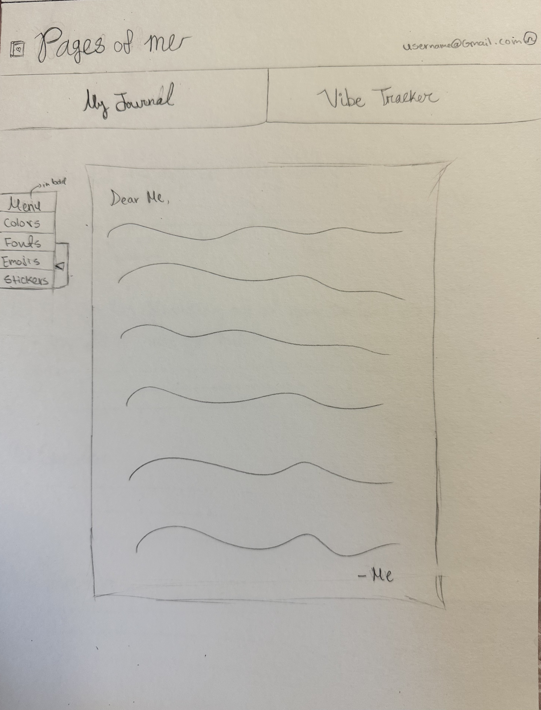

# Pages of Me

[View Notes](notes.md)

## Specification Deliverable

### Elevator pitch

In high school, most of us go through a phase of keeping a journal, where we write about our day-to-day activities and emotions, only to forget about it the next day.

Have you ever wanted to go back to these journals? Perhaps you are reminiscing these days and want to relive the joyful moments you had with your loved ones. In another case, you might want to reflect on your personal growth and how far you have come to leave the past in the past. 

With Pages of Me, you can easily maintain a journal that you can edit in your style. Additionally, there will be a section for a short survey where you can log in your moods and feelings and their triggers which allows you to notice beneficial and harmful habits that you might want to either progress or prevent doing based on your personal goals.

### Design
<!--  -->
 
 

### Key Features

* Secure login over HTTPS
* Two tab choices to swtich between the journal and survey
* Display of note sheet
* Menu to adjust the theme of the journal
* Ability to choose different colors, fonts, stickers from the menu
* Ability to scroll across the slider for mood entry
* Button next to survey questions to add notes
* Ability to create an account to save information

### Technologies

* **HTML** -- Uses correct HTML structure for application. Three HTML pages:
1. One for creating an account
2. One for the journal
3. One for the survery

    HTML will also be used for the structure of the tabs, text area for note taking and journal, drop down buttons for menu options, and slider for mood entry.

* **CSS** -- Application styling that suits every device, theme and colors chosen by user for font and note sheet color, white background. 

* **Javascript**: 
1. Handles log in submission (when user inputs info)
2. Pushing the tab buttons to switch between journal and survey
3. Handles buttons for menu options like colors, stickers, etc...
4. Handles note input

* **React** -- Displays login page, menu, react router for navigation for text entry, and other compenents for adjusting the colors, fonts etc...

* **Web service**:
1. Creating account/login
2. Inputing text
3. Changing theme/colors
4. Storing text and information

* **DB/Login**:
1. Saves text input and stores them in database
2. Creating account and logging in
3. Can't access journal unless logged in

* **WebSocket** -- Real-time updates, such as mood entries, reflecting live updates of moods with other users, and notifications